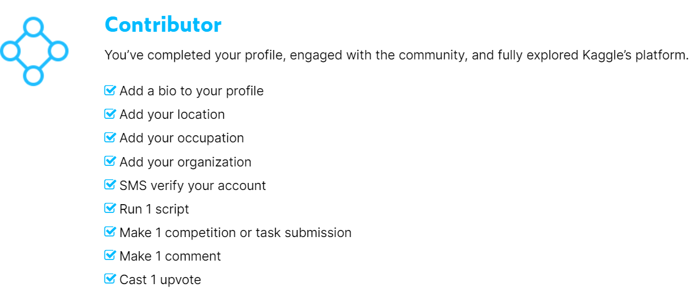

I had been procrastinating couple (out of a ton ;)) of important tasks for a long time - writing blogs and participating in kaggle. Finally broke one early July - I did submit a kernel by participating in a contest organized by CTDS.show. I had been following CTDS.show podcasts for a while, so when a contest was organized by them on the podcast series itself, I immediately jumped to it. Now I am breaking the second one - writing a blog. As a first blog topic, I thought why not share my experience with kaggle platform. I believe first time kagglers could relate many of the pointers and may find some useful tips from this article. Here we go!!

BTW here's the [link](https://www.kaggle.com/rohanrao/chai-time-data-science) to kaggle contest, which I participated: 

I opened an account in kaggle 10 months back, but haven't done anything until end of June. I was at Novice level - basically did nothing level:)
Here's my submitted [kernel](https://www.kaggle.com/vinothsuku/1-year-of-ctds-journey-and-what-we-infer)

## What I noticed first or wanted to understand when I started:

- **Different Kaggle categories of Expertise:** There are 4 categories: Competitions, Notebooks, Datasets and Discussion. Quick notes -

Competitions (compete in the competitions hosted by kaggle across wide variety of topics), Notebooks (explore and run ML code), Datasets (contributing datasets to kaggle can set some tasks as well) and Discussion (Forums)

- **Medals and Performance Tiers:** As with any gamification, we have bronze, silver and gold medals being awarded across all categories based on upvotes (except competitions-where medals depend on size of the competition like how many teams/people are competing and where are we placed). Additional details are [here](https://www.kaggle.com/progression)
There is no limit in earning medals-as long as we meet the conditions specified.

## How did I start:-

- After understanding performance tiers, I updated my profile (just that) and moved to **Contributor level**. It feels good and keeps you going as you are a level up now from being a novice. I have seen many kagglers not even completing their profile, which is one of the easiest to begin (see below) with, would urge them to do so as first task.

- **Entering the contest:** There are 4 main parts to understand first-Goal of the contest, understanding data, evaluation criteria and any conditions apply stuff (like using external datasets, sharing notebooks, using GPU/TPU and related conditions, participating in teams and so on). These 4 areas as important for participating in any contest in kaggle as it varies between competitions.

- **Jump start problem:** Its a common problem, which we need to overcome. I did spent too much time just looking at those 4 pillars as if its in art form. Luckily in this contest, there was an amazing starter kernel by Parul Pandey, which provided guidance to get started and a workshop was arranged by the host Sanyam Bhutani. It provoked people like us to submit whatever we have and then iterate it over time with refinements.

I would suggest to just go ahead by submitting a kernel and iterate over time, don't wait for perfection even with version 1. Once I did first submission, saw feedback and got some upvotes, it was a good feel. Such votes/comments/feel good factors will be the driving factors to let us do more.

- **Reading public kernels:** Beauty of kaggle platform is the awesome community - we can learn from each other. I spent and will spend good enough time in exploring kernels.

- **Using Discussions forum:** Use discussion forums to the fullest for any query that we may have. Better to clarify that assuming. People are almost instantaneous in responses.

## Few beginner tips:-

- Once the competition starts, try to **make first submission asap**. It will even get first mover advantage.
- **External packages** can be installed in the kernel. we can use !pip install <package name>. To do this in right side of pane (while editing kernel) in Settings - Internet should be on (by default it will be on). Just check in case there is any issue.
- I we need to use **external dataset**, we have to first upload them (it could be private/public). Some contests might state we can use external datasets only if its made public. Adding data can be found in the right pane.
- Save **multiple versions of kernels as we iterate**, its easy to go back, compare, pin them, share whatever version that we want to.
- Don't hesitate to open up a topic in **discussions**. Participate more and let everyone know your thoughts or ask for help. Kaggle is very active community. we get response almost immediate.
- Use **"Markdown"** effectively to communicate the story/adding comments for viewers to understand better. html code works well, it can be properly formatted and be made good looking.
- **Explore the kernels across the platform**, start with picking ones that got more votes, which means it was more useful and understand how people have approached the problem. If there are any questions or wanted to find kernels related to specific topics (like time series, image classification, sentiment analysis etc), use search bar - its effective and should be first goto than googling. There could be even discussion topics with collated information for broader topics..so keep exploring.
- **Follow kagglers:** We could learn from their experience. Kagglers are giving back to the society on what they have learnt. I guess many of them aren't even looking at license terms. They just wanted to learn and contribute.
- **Avoid spamming:** There are some kagglers who misuse the platform for gaining upvotes. Typically they provide link to their kernels across many other kernels asking for upvotes, kindly don't do that, its not being respected among the community. You could even see comments from Kaggle team (on such topics) like "stop scamming" and if it continues kaggle team will disable such accounts. To begin with people might witness downvotes for such comments.
- There are **starter competitions** that will always be there (like Titanic, House price predictions). Its a good place to start.
- Reg Datasets, do contribute by gathering interesting data (sports, audio clips like podcasts, tweets, reviews, images etc) from portals (Scraping/collating data from multiple portals). Only aspect to note while doing so is the license aspect from the sources. We should comply to that.
- Participate in Discussions: Easily earn medals tally healthily

## Concluding:-

**Every submission was evaluated by 4 Kaggle Grandmasters. Happy to share that I won the competition in Data Visualization category**

Kaggle is amazing community to learn and share everything related to AI, ML, DL. Anyone wants to get into data science/ML - should explore and be active in kaggle. It will help us hone our skills and learn a lot of techniques.
We will get a feel that we are part of a larger company and every kaggler is our colleague.
