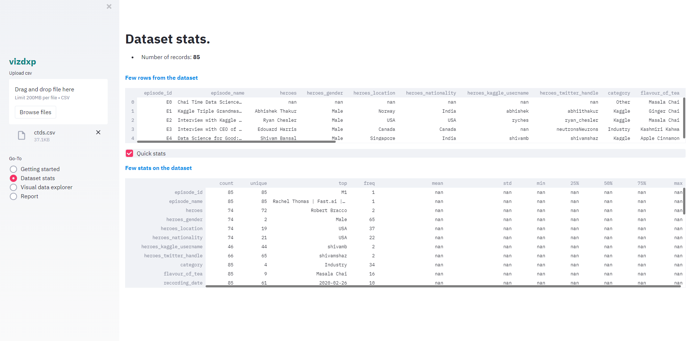
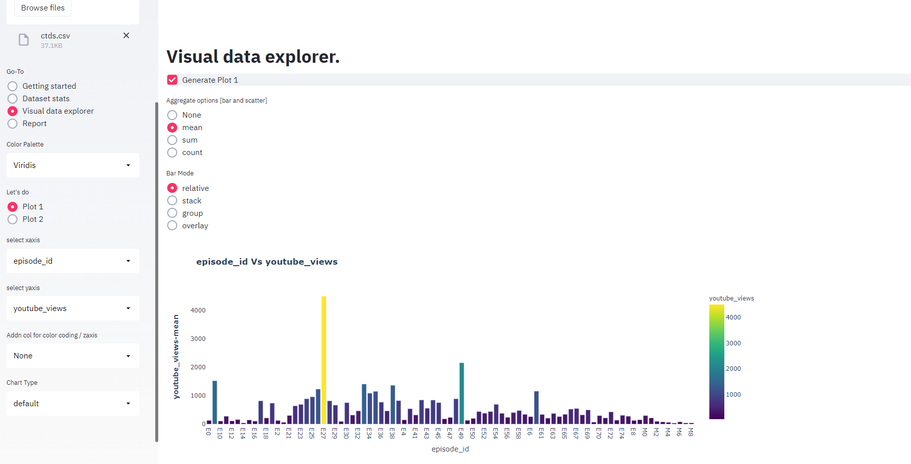
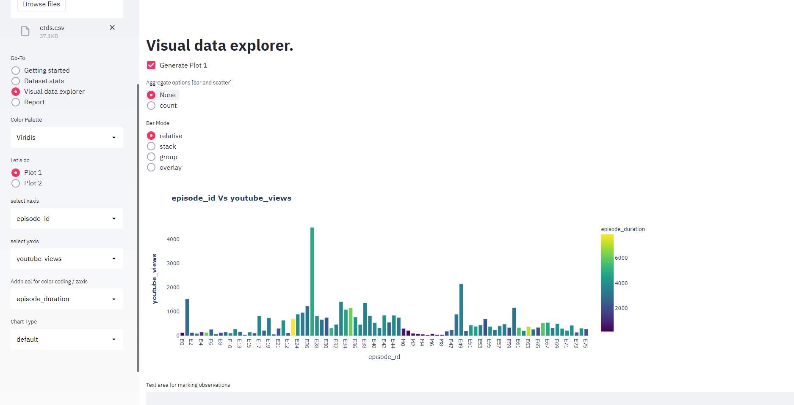
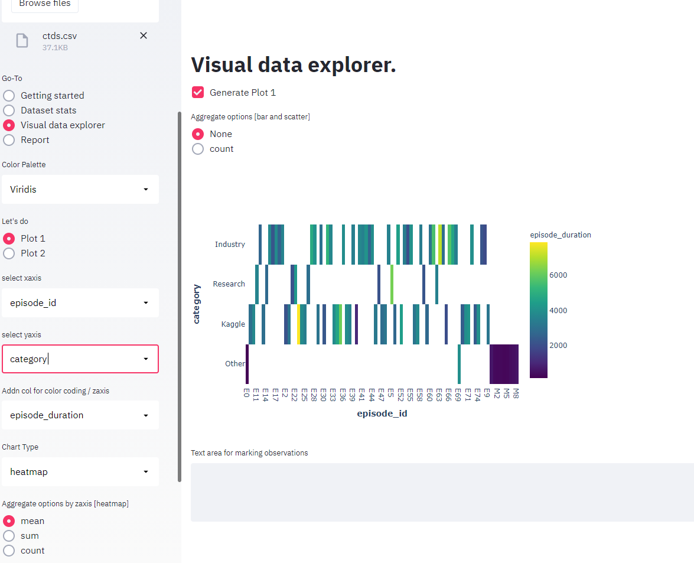
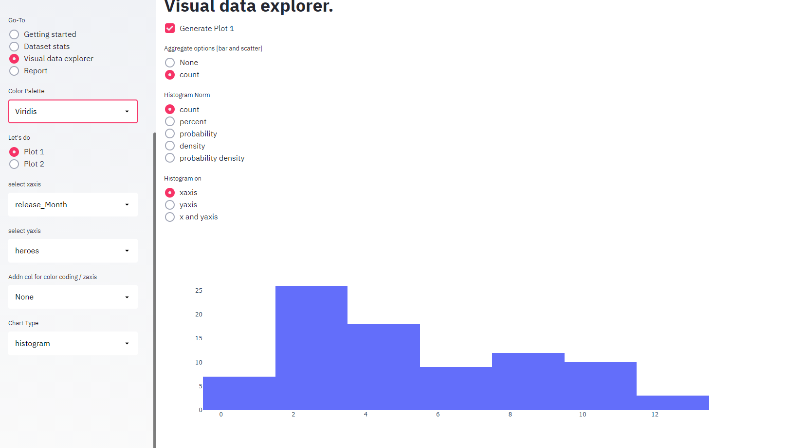
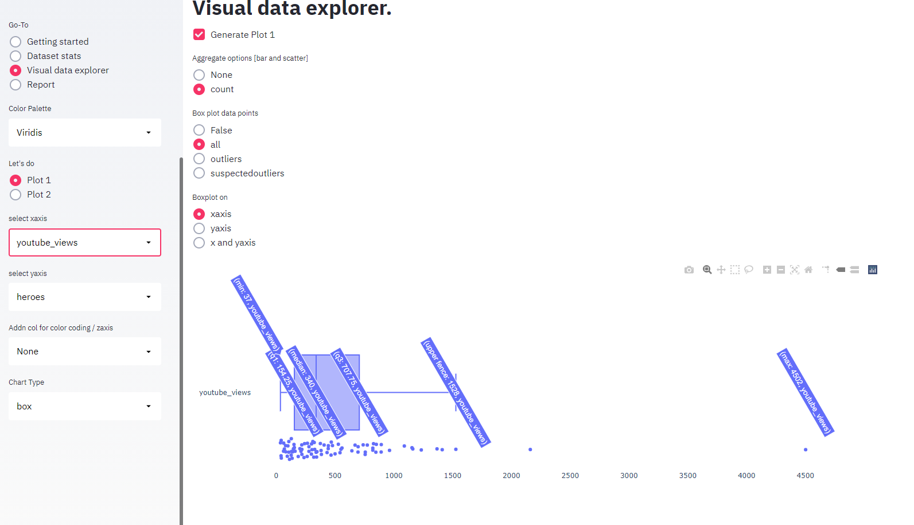

vizdxp is an open-source web application designed via streamlit and weaved with plotly library. **Its incredibly simple to use - Just drag & drop any csv and explore the data visually.** By default the application will figure out better visualization based on user selections. Feel free to customize as needed.

## Key Features
- **Simple** and quick for any **Exploratory Data Analysis**
- Create interactive **Dashboard web app within minutes** from any csv and share the findings
- **Deploy** it as a web application in your own workstations too
- By **Default** - chart types and aggregations are applied based on columns selected by user, null rows are removed, date fields are converted to multiple subfields
- Highly **Customizable** 
- Easily **Extensible** for additional chart types
- No more static reports. Host this webapp in your organization, intended users can explore their view instead of just viewing processed static reports
- Chart types included - Scatter, Bar, Pie, Heatmap, Histogram and Box plots

## Installation
(In a terminal/command prompt)
>pip install vizdxp

(After Installation is complete)
>python -m vizdxp

Explore vizdxp through a browser. Once installation is complete, user can work totally offline.

**This package is also hosted [online](https://vizdxp.herokuapp.com).** Pls feel free to explore with your own data

## Steps to explore
- upload your data in .csv format in the left pane (max limit 200mb)
- Once the data is uploaded, user can get quick view about the dataset in **"Dataset stats"** by clicking the radio button in the left pane
    - Glimpse few rows from the dataset to get a sense of the dataset
    - Total records
    - By column: count, unique value count(unique), top unique valued record (top) and its frequency(freq), mean, standard deviation(std), min value(min), max value(max), percentiles 25%, 50% and 75%
    
- select **"Visual Data Explorer"** in the left pane
    - select xaxis, yaxis and click "Generate Plot 1 in right pane" to get default graph. **Based on chosen columns, default graph type and options will be generated**. User can change graph type and options based on the need.
    
    - If user wants to see 3rd axis view, user can select **"Addn col for color coding/zaxis"**. Against x vs yaxis, color code will be applied based on 3rd column selection
    
    - Feel free to explore graph types like **heatmap, box plots, histograms**, which gives different perspectives about the data but less explored chart types
    <figure><figcaption style="text-align:center">Heatmap</figcaption></figure>
     
    <figure><figcaption style="text-align:center">Histogram</figcaption></figure>
     
    <figure><figcaption style="text-align:center">Box</figcaption></figure>

## License
- vizdxp is completely free, open sourced and licensed under MIT license.
- Vizdxp is developed with Streamlit as the framework. Further details on [streamlit](https://www.streamlit.io/)
- Plotly is the visualization library used. Further details on [plotly](https://plotly.com/)

<h6 style="color:grey"> © 2020-21 Vinoth Sukumaran. Feel free to connect with me <a href='mailto:vsuku15@gmail.com'>email</a>
