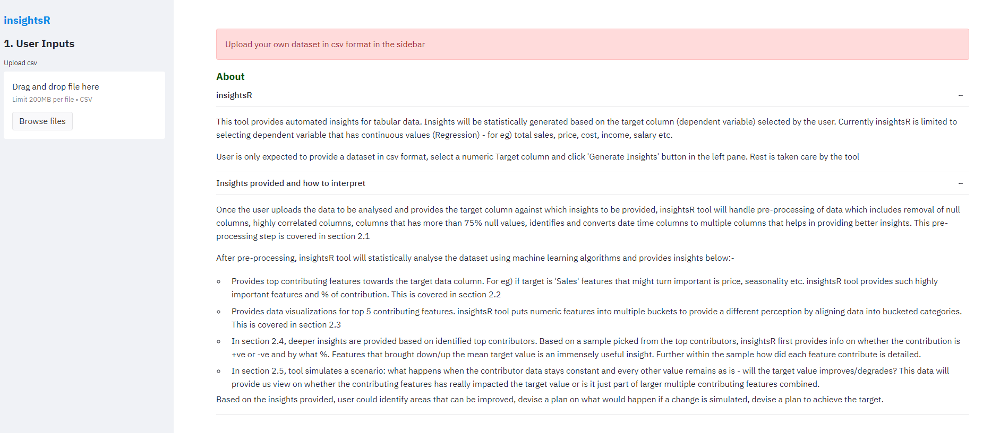
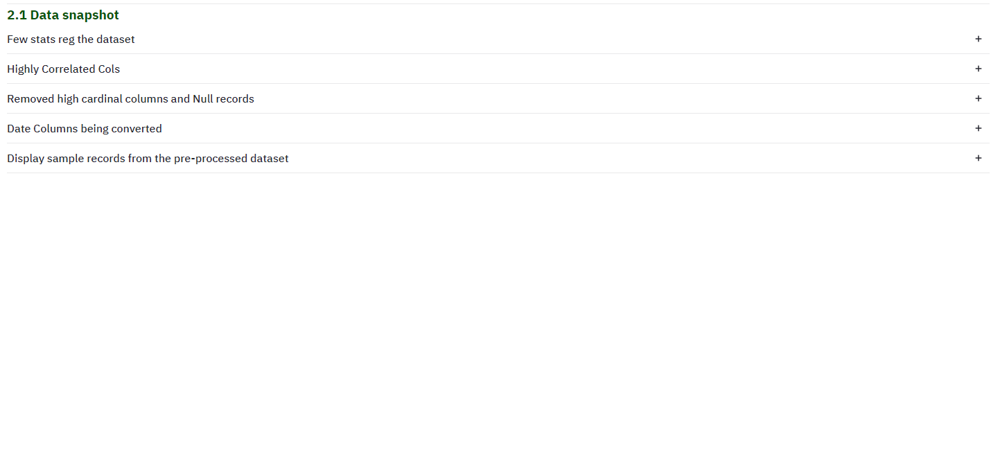
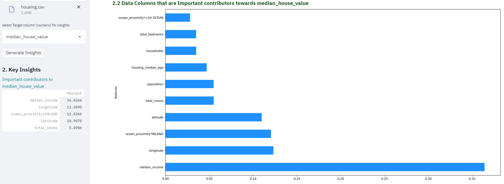
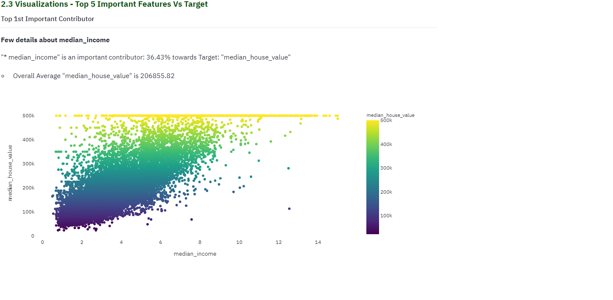
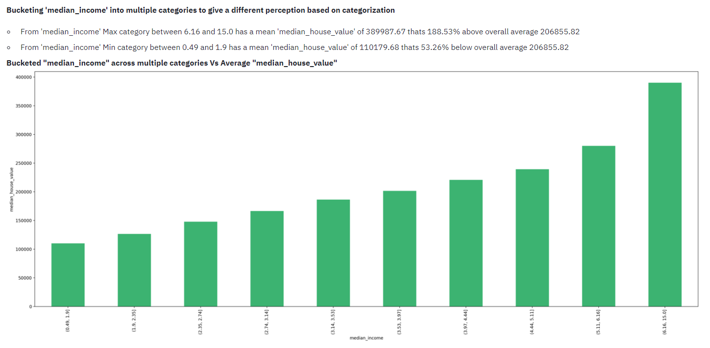
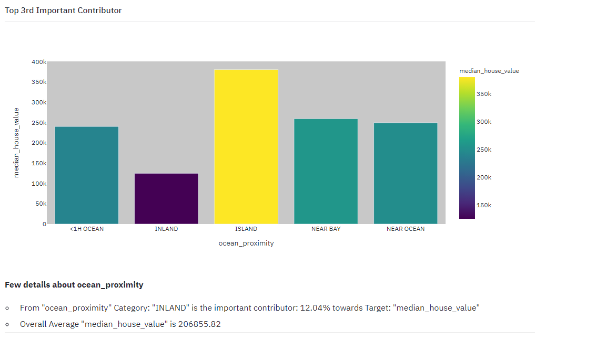
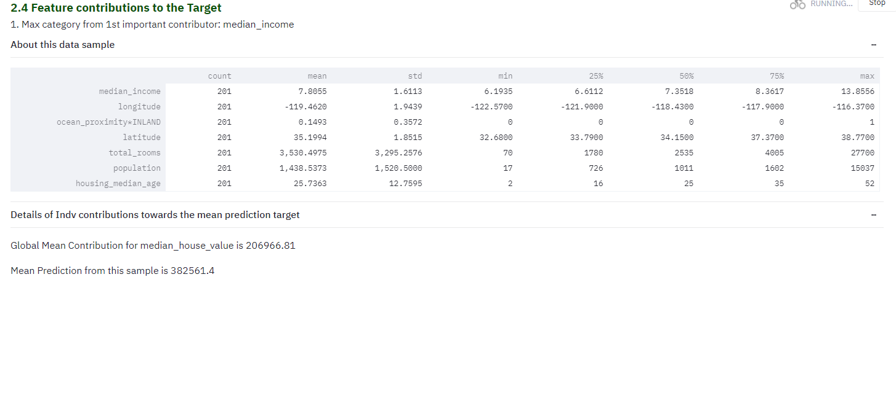
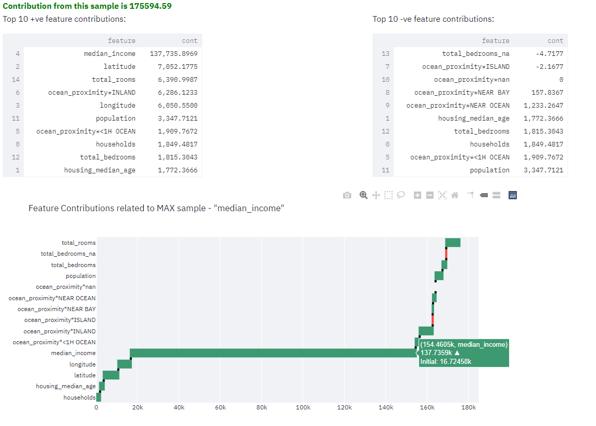
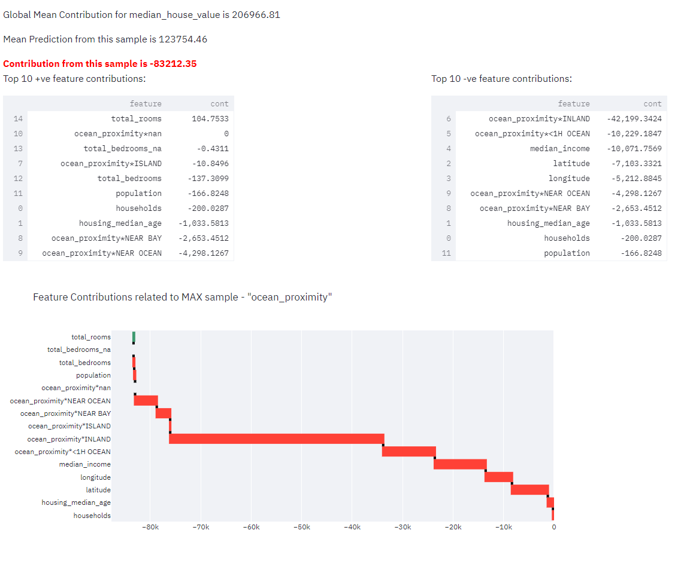
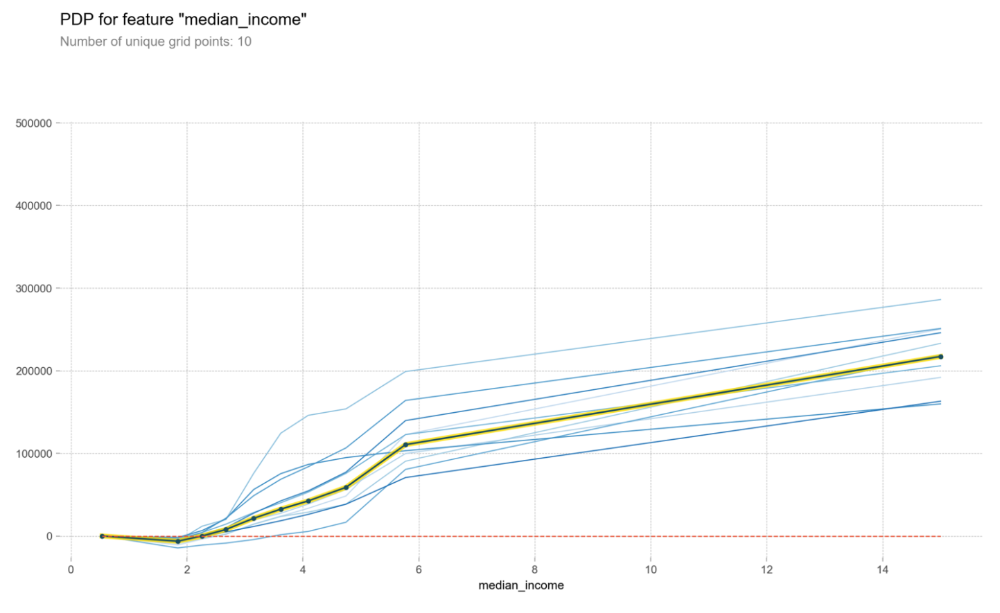

## About
This tool provides automated insights for tabular data. Insights will be statistically generated based on the target column (dependant variable) selected by the user. Currently insightsR is limited to selecting dependant variable that has continuous values (Regression) - for eg) total sales, price, cost, income, salary etc. Continuous variable can take any values..

**User is only expected to provide a dataset in csv format, select a numeric Target column and click 'Generate Insights' button in the left pane. Rest is taken care by the tool**

## Insights provided and how to interpret

Once the user uploads the data to be analysed and provides the target column against which insights to be provided, insightsR tool will handle pre-processing of data which includes removal of null columns, highly correlated columns, columns that has more than 75% null values, identifies and converts date time columns to multiple columns like year, week, day of week etc that helps in providing better insights. This pre-processing step is covered in section 2.1

After pre-processing, insightsR tool will statistically analyse the dataset using machine learning algorithms and provides insights below:-
- **Top Contributors:** Provides top contributing features towards the target data column. For eg) if target is 'Sales' features that might turn important is price, seasonality etc. insightsR tool provides such highly important features and % of contribution. This is covered in [section 2.2](#top-contributors)
- **Data visualizations:** Provides data visualizations for top 5 contributing features. insightsR tool puts numeric features into multiple buckets to provide a different perception by aligning data into bucketed categories. This is covered in [section 2.3](#data-visualizations)
- **Deeper insights:** In [section 2.4](#deeper-insights), deeper insights are provided based on identified top contributors. Based on a sample picked from the top contributors, insightsR first provides info on whether the contribution is +ve or -ve and by what %. Features that brought down/up the mean target value is an immensely useful insight. Further within the sample how did each feature contribute is detailed.
- **Change:** In [section 2.5](#change), tool simulates a scenario: what happens when the contributor data stays constant and every other value remains as is - will the target value improves/degrades? This data will provide us view on whether the contributing features has really impacted the target value or is it just part of larger multiple contributing features combined.

Based on the insights provided, user could identify areas that can be improved, devise a plan on what would happen if a change is simulated, devise a plan to achieve the target.

## Let us explore with a sample dataset picked from [link](https://github.com/ageron/handson-ml/blob/master/datasets/housing/housing.csv)

2.2 
# Top Contributors
dfdfdfdf

2.3 
# Data Visualizations
sdsdsd

2.4 
# Deeper insights
sdsdsd

2.5
# Change

## Credits
- I learned and will continue to learn from [fast.ai](https://fast.ai). This tool is largely based on Machine Learning course taught by Jeremy Howard
